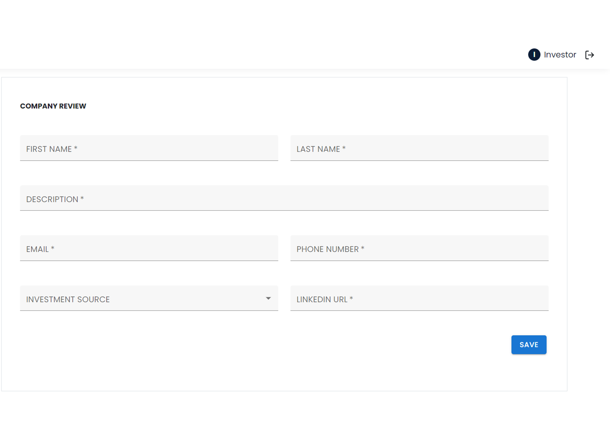

<br><br>

<!-- project philosophy -->


> Launchify is designed to provide startups with essential tools and strategies to achieve their business goals. By offering a comprehensive, data-driven platform, Launchify helps startups streamline processes, manage financial performance, connect with mentors, and secure investment opportunities. This holistic approach empowers startups to focus on innovation while receiving tailored support, ensuring a more efficient path to success. Through mentorship, financial analysis, and investment facilitation, Launchify fosters an environment where startups can thrive and reach their full potential

### User Stories

Startup

As a startup, I want to input my business data so I can receive tailored strategies to reach my goals.<br>
As a startup, I want to track my financial performance using the finance dashboard, so I can make informed decisions.<br>
As a startup, I want to request mentorship through the platform, so I can gain expert guidance and advice.<br>
As a startup, I want to provide detailed information about my investment needs, so I can attract potential investors.<br>

Investor

As an investor, I want to browse startup profiles and investment opportunities, so I can find projects that align with my interests.<br>
As an investor, I want to view detailed startup information, so I can make informed investment decisions.<br>

Mentor

As a mentor, I want to accept or decline mentoring requests, so I can manage my engagements with startups effectively.<br>
As a mentor, I want to offer advice and guidance to startups, so I can help them grow and succeed.

<br><br>

<!-- Tech stack -->


### Launchify is built using the following technologies:

<li>This project uses the Laravel web development framework for the backend. Laravel is a robust PHP framework that provides powerful tools for building scalable and maintainable applications, with built-in support for routing, authentication, and database management.</li>
<li>For the database, Launchify uses MySQL, a reliable and widely-used relational database that ensures efficient data storage and retrieval, providing the platform with a solid foundation for managing startup, mentor, and investor information.</li>
<li>The frontend of the platform is built using React, a modern JavaScript library for building user interfaces. React allows for creating dynamic and responsive components that provide a seamless user experience across different devices.</li>
<li>For handling payments, Launchify integrates Stripe, a secure and scalable payment gateway that enables startups to manage transactions with ease and ensures investors can make safe, real-time investments.</li>
<li>To enable real-time communication features, Launchify uses WebSocket. This technology allows mentors and startups to engage in live chat sessions, enhancing communication and collaboration.</li>

<br><br>

<!-- UI UX -->


> We designed Launchify using wireframes and mockups, refining the interface through multiple iterations to achieve an intuitive layout that ensures easy navigation and an optimal user experience.

- Project Figma design [figma](https://www.figma.com/design/OchjRDJIXGTsZvAcgiX8Jq/Platform-Startup-assistance?node-id=0-1&t=mNU2gk70JUhu0IVy-1)

<br><br>

<!-- Database Design -->


### Architecting Data Excellence: Innovative Database Design Strategies:

- Insert ER Diagram here


<br><br>

<!-- Implementation -->


### Admin Screens (Web)

| Register screen                            | Login screen                       | Landing screen                        |
| --------------------------------------- | ------------------------------------- | ------------------------------------- |
|  |  |  |
| Startup Profile screen                             | Investor Profile Screen                           | MEntor Profile Screen                          |
|  |  |  |

<br><br>

<!-- Prompt Engineering -->


### AI-Driven Strategy Generation for Startups:

- The AI strategy generation function integrates with OpenAI's GPT model to create personalized business strategies for startups. It pulls data specific to each startup, such as industry, key challenges, and goals, to generate five actionable strategies following a structured format. Each strategy includes a name, description, action steps, and potential challenges. The AI request is securely made using the OpenAI API, and the generated strategies are parsed, stored in the database, and returned as a response to the user. This process ensures tailored and relevant strategic insights to address the startup's unique circumstances.

<br><br>

<!-- AWS Deployment -->


### Efficient AI Deployment: Unleashing the Potential with AWS Integration:

- This project leverages AWS deployment strategies to seamlessly integrate and deploy natural language processing models. With a focus on scalability, reliability, and performance, we ensure that AI applications powered by these models deliver robust and responsive solutions for diverse use cases.

<br><br>

<!-- Unit Testing -->


### Precision in Development: Harnessing the Power of Unit Testing:

- This project employs rigorous unit testing methodologies to ensure the reliability and accuracy of code components. By systematically evaluating individual units of the software, we guarantee a robust foundation, identifying and addressing potential issues early in the development process.


<br><br>

<!-- How to run -->


> To set up Coffee Express locally, follow these steps:

### Prerequisites

This is an example of how to list things you need to use the software and how to install them.

- npm
  ```sh
  npm install npm@latest -g
  ```

### Installation

_Below is an example of how you can instruct your audience on installing and setting up your app. This template doesn't rely on any external dependencies or services._

1. Get a free API Key at [example](https://example.com)
2. Clone the repo
   git clone [github](https://github.com/your_username_/Project-Name.git)
3. Install NPM packages
   ```sh
   npm install
   ```
4. Enter your API in `config.js`
   ```js
   const API_KEY = "ENTER YOUR API";
   ```

Now, you should be able to run Coffee Express locally and explore its features.
